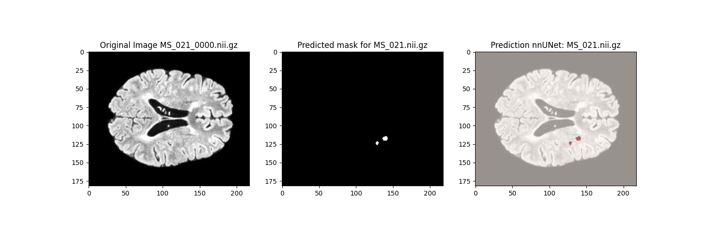
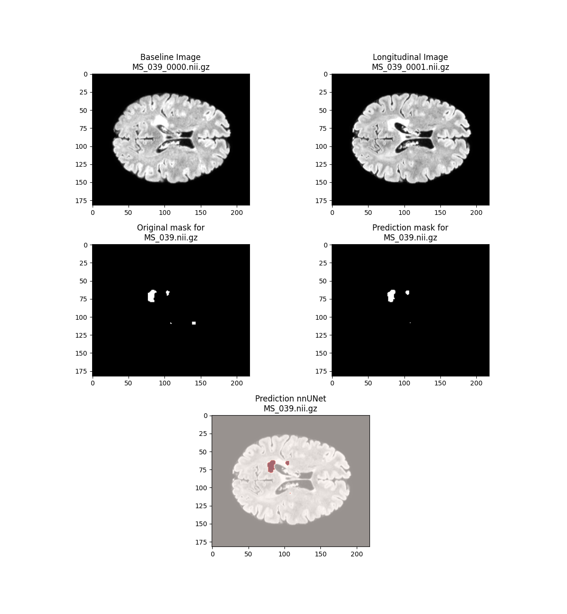

# MS_Segmentation_nnUNet
Código utilizado para implementar nnUNet en el proyecto de fin de master de Jover Erreyes Pilozo. Todo el proceso se ha llevado a cabo en Pycharm, creando un entorno virtual mediante pipenv. Se ha utilizado un dispositivo con una GPU RTX3050 de 8GB, 16GB de RAM, un procesador 11th Gen Intel(R) Core(TM) i5-11300H @ 3.10GHz 3.11 GHz en el sistema operativo Windows 11

# Codigo completo
link: _https://drive.google.com/drive/folders/1yjUw3Nej3-TyFsOwPg2XRbIsTkz2UOUK?usp=share_link_

# Codigo
1. En el archivo de python main.py, se crea la estructura de carpetas necesarias para trabajar con nnUNet. De la misma forma, con esta parte del codigo se crea el archivo dataset.json con la información necesaria para ejecutar los diferentes comandos de nnUNet
2. En el archivo utils.py se encuentran las diferentes funciones utilizadas a lo largo del codigo
3. En el archivo View_results.py se encuentra el codigo para obtener la predicción de las imagenes, en este codigo se leen los diferentes archivos originales, la máscara predicha por nnUNet y esta se solapa con la imagen original y se destaca en rojo la parte predicha en caso de tener lesiones
4. En el archivo Results_Notebook.ipynb se encuentran los diferentes pasos seguidos para encontrar la mejor manera de representar el archivo original junto con la mascara

# Archivos necesarios para replicar el codigo
- main.py
- utils.py
- View_results.py
- data.zip

A partir de main.py se descomprimen los archivos de imagenes, se crea la estructura de carpetas necesarias para nnUNet, se copiar y renombran los archivos y se colocan en las carpetas correspondientes, se crea un json con los metadatos para cada grupo de imagenes y su respectivo label, con esta información se crean el json y ya es posible iniciar el proceso de preprocesado con el comando adecuado que se encuentra en 'commands.txt'. De la misma manera es necesario establecer previamente las diversas variables de entorno para poder ejecutar los diversos comandos.

# Ejemplo de resultado obtenido

