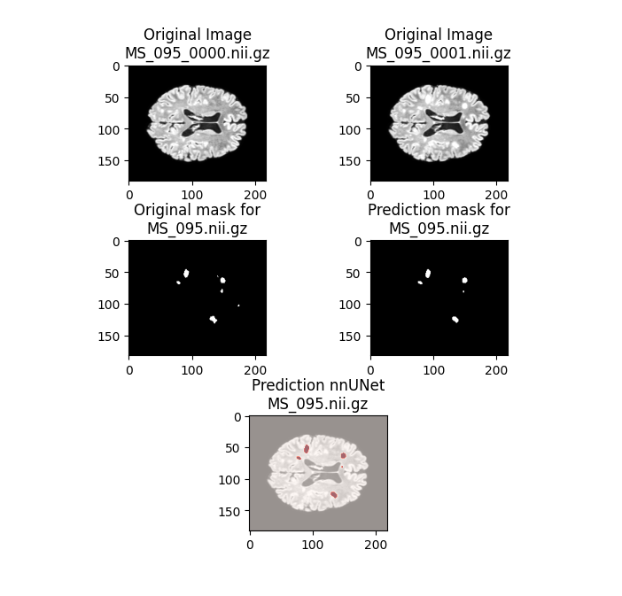
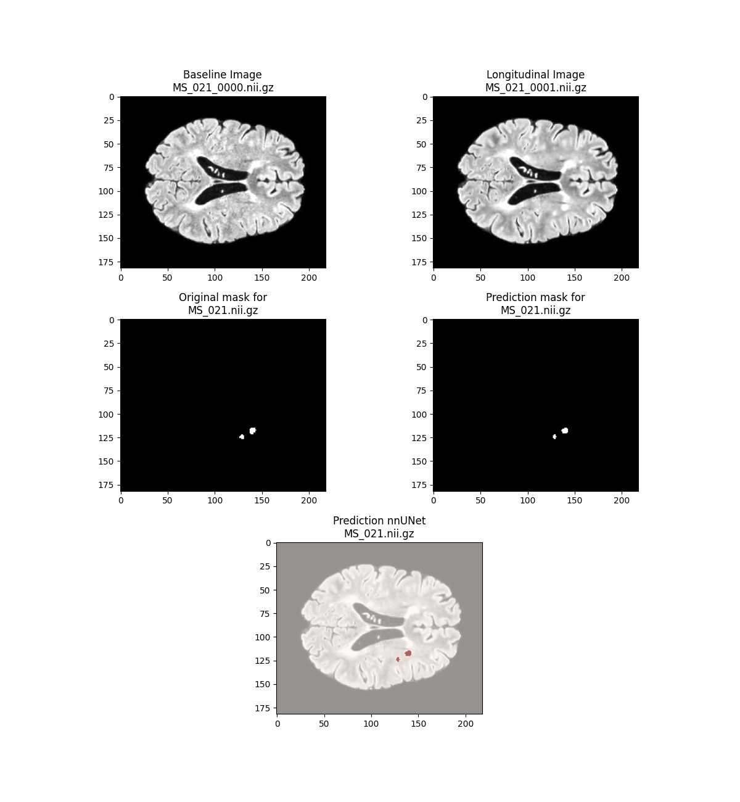
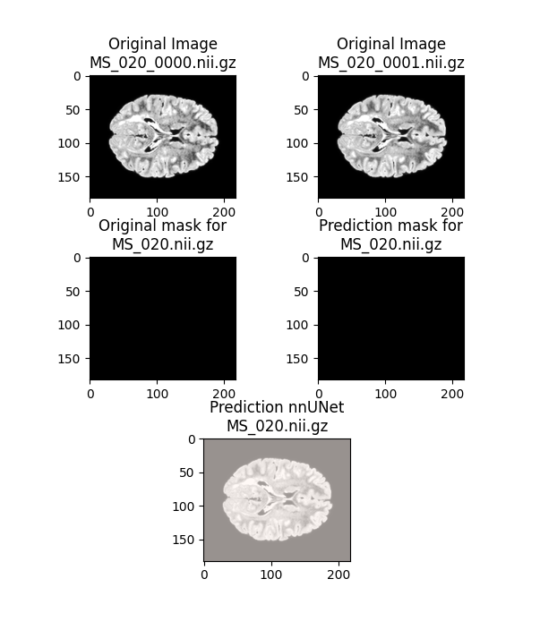

# MS_Segmentation_nnUNet
Código utilizado para implementar nnUNet en el proyecto de fin de master de Jover Erreyes Pilozo 

# Codigo completo
link: _https://drive.google.com/drive/folders/1yjUw3Nej3-TyFsOwPg2XRbIsTkz2UOUK?usp=share_link_

# Codigo
1. En el archivo de python main.py, se crea la estructura de carpetas necesarias para trabajar con nnUNet. De la misma forma, con esta parte del codigo se crea el archivo dataset.json con la información necesaria para ejecutar los diferentes comandos de nnUNet
2. En el archivo utils.py se encuentran las diferentes funciones utilizadas a lo largo del codigo
3. En el archivo View_results.py se encuentra el codigo para obtener la predicción de las imagenes, en este codigo se leen los diferentes archivos originales, la máscara predicha por nnUNet y esta se solapa con la imagen original y se destaca en rojo la parte predicha en caso de tener lesiones
4. En el archivo Results_Notebook.ipynb se encuentran los diferentes pasos seguidos para encontrar la mejor manera de representar el archivo original junto con la mascara

# Ejemplo de resultado obtenido

